# T1A2 - Portfolio Website Assignment - Coder Academy
## David Oliverius - Melbourne, Web Dev Standard 2022
#### Project URL: https://davidoliverius.github.io/
#### Github URL: https://github.com/DavidOliverius/DavidOliverius.github.io
---
## Purpose
Beginning this project was a small step in my career but a giant leap in my confidence. Building a website from scratch allowed me to dive in and really get my hands dirty - with many hours of tinkering - which resulted in creating something I am incredibly proud of. I now have a personal portfolio which I can add to over time as my skills grow and I complete new projects.
## Functionality / Features
When building my website, foremost in my mind was getting to grips with Flexbox and letting it do as much work as possible, having a responsive design that will work for any user on any device. It also has a welcoming and calming aesthetic achieved with negative space and a minimal design.
#### Welcome Section
Using a background generated at https://meshgradient.in/, this section uses big bold text welcoming the user to the site and a simple hover attribute to reveal my surname when the user mouses over the text.
#### Navbar
After originally wanting to include a more complex Hamburger style menu, after actually implementing one I found it to be complete overkill. I went back to a much simpler layout for the Navbar which simply displays the main sections on the home page, and using Flexbox it switches to Column view when viewed on a smaller display for better readability.
#### Colour Scheme
After many hours of back and forth on colour choices, I finally landed on a selection I was happy with using https://coolors.co/. These colours appealed to me as rich, calming and something you wouldn't normally expect, and in tandem with the font choices I am happy with the end result, utilising different shades of greys over the colour palette for readability.
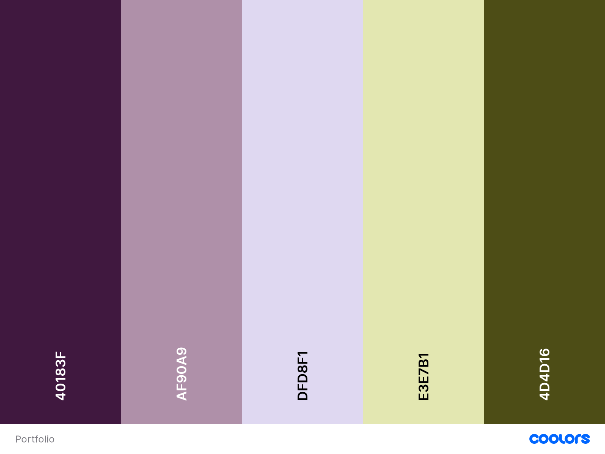
#### Clear Sections
Using a generous amount of padding I created clear sections that I could place information in with distinctive coloured backgrounds, utilising Flexbox to organise the content within. This is the key behind the website having a modern look.
#### Blog Posts
A Web 2.0 inspired blog post component is used extensively throughout the site as both a preview for the blogs on the home page, and the blog pages themselves surrounded by images. Using media queries and Flexbox, these dynamically move around the page depending on the user's device and screen size. I used the same border for blog images so that I could place the images around the blog itself, utilising Flexbox to arrange them around the text.
#### Back to Top Arrow
While not included in my original wireframes in planning the layout, I found that once I had filled the page with content that there was **too** much scrolling, and so placing an arrow that takes the user to the top of the page at the end of each section makes navigating much more intuitive. The arrows only appear on the blog posts in mobile view as they were unnecessary in desktop views.
#### Webp Images
After an audit of my website using Lightbox within Google Chrome, I was recommended to use a more modern image format in **webp**. I ditched my **jpgs** and **pngs** - all of the images on the website are now **webp** and it dramatically reduces the overall size of the website, as well as loading times for the user. The entire project comes in at 2.3MB.
#### Footer
The footer is used throughout the site as a nice cap off to the aesthetic of each page, but more importantly as an easy way for anyone to get in contact with me, with intuitive icons indicating links to my LinkedIn and Github profiles, as well as my email address.
## Target Audience
The website is designed to appeal to potential employers in my goal to be hired in the future as a Junior Web Dev. I hope it showcases technical skill and some of my personality.
## Tech Stack
- HTML
- CSS
- Github (for Deployment)
## Sitemap

## Screenshots
### Home Page Landing - Desktop
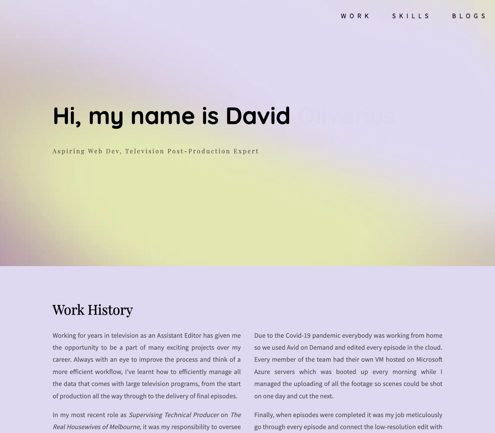
### Home Page Landing - Mobile
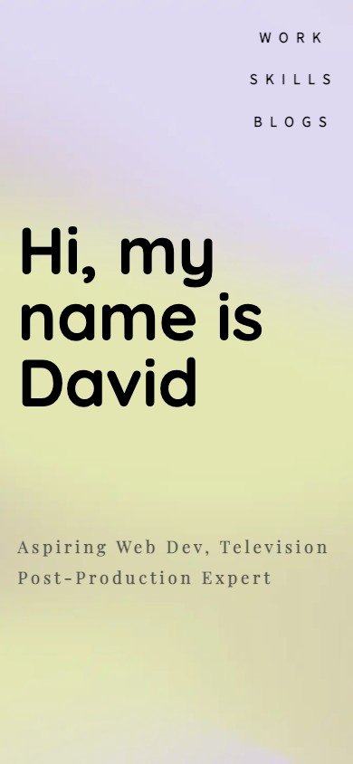
### Skills Section - Desktop
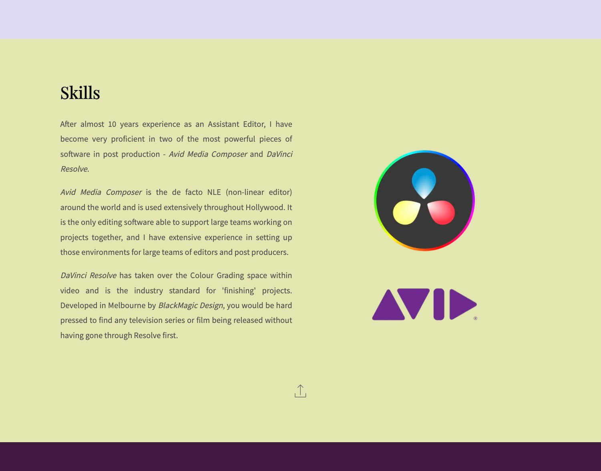
### Skills Section - Mobile
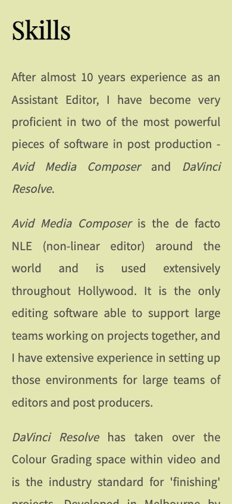
### Blog Preview Section - Desktop
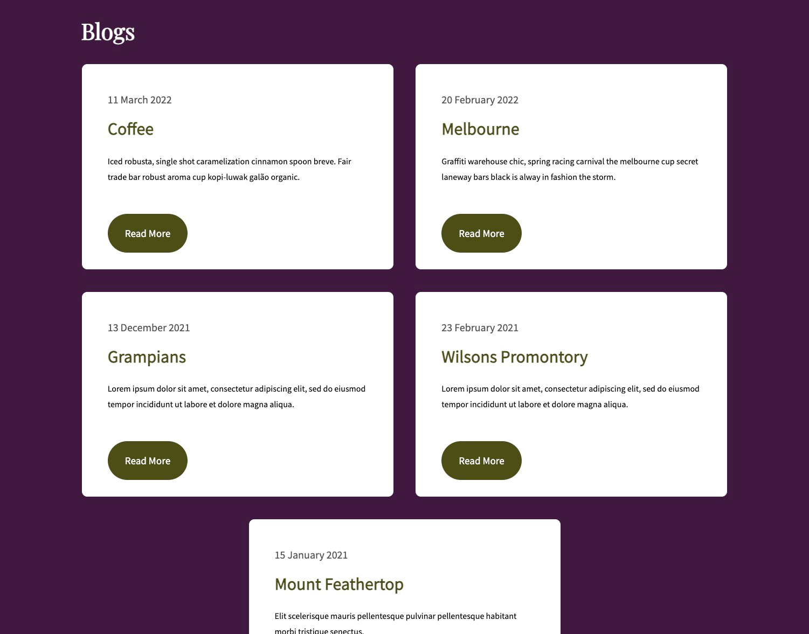
### Blog Preview Section - Mobile
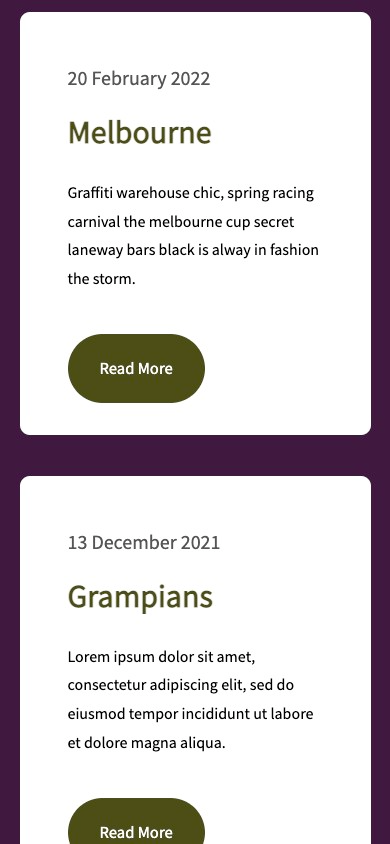
### Blog Page - Desktop
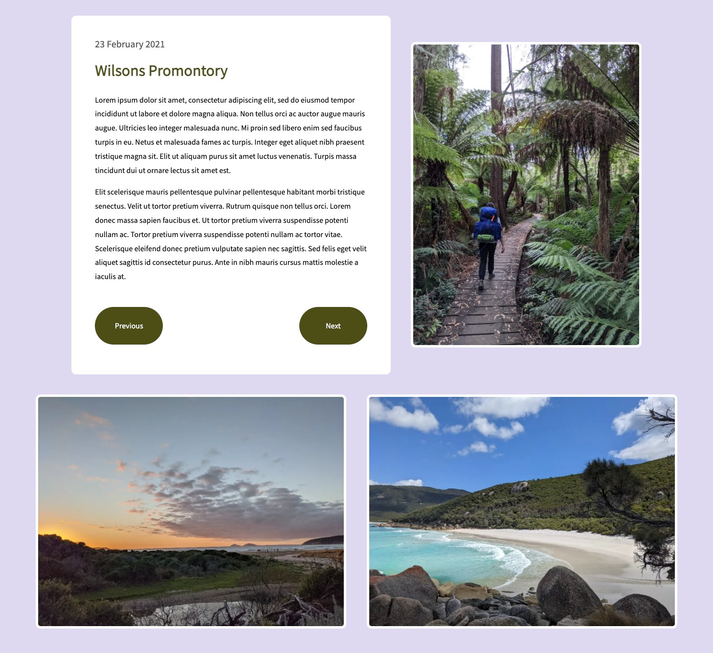
### Blog Page - Mobile
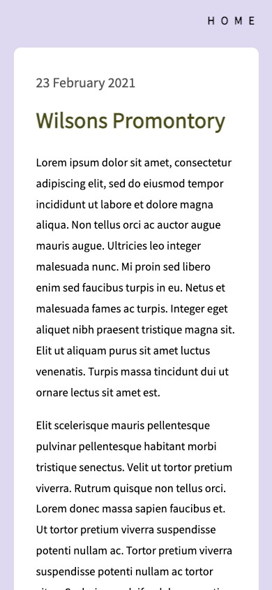
---
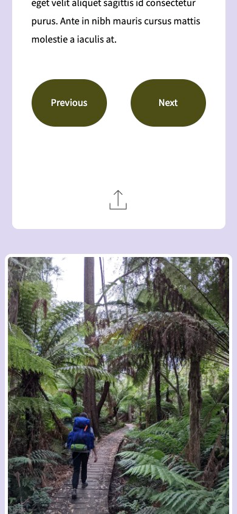
### Footer Section - Desktop

### Footer Section - Mobile
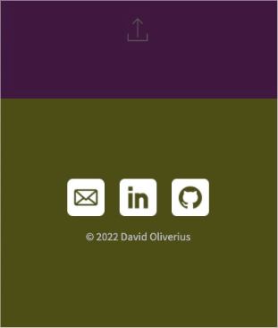
